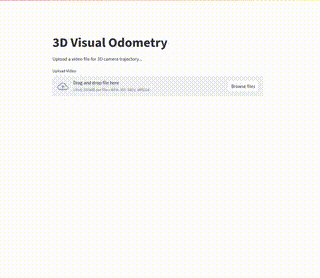

##### Forked from: https://github.com/GuidoManni/BodySLAM

## 🚀 Plotting a 3D trajectory from poses

Given a video, this tool will do a pose estimation and plot the 3D trajectory of the camera based on the poses

## 🚀 Installation via Docker (Recommended method)

1. Clone the repository:
   ```bash
   git clone https://github.com/venkyiyer/visual_odometry.git
   cd visual_odometry
   ```
2. Download the pose estimation pre-trained model from here: https://huggingface.co/gvide/CycleVO/tree/main. 
   Place it in the root folder (visual_odometry/)
   
4. Build the docker file:
   ```bash
   docker build -t vis_od_tool .
   ```

5. Run the docker image
   ```bash
   docker run -p 8501:8501 vis_od_tool
   ```

6. Open the URL through browser: http://0.0.0.0:8501

## 🚀 Local installation

1. Install virtualenv and create a virtual environment:
   ```bash
   sudo apt install python3-virtualenv
   virtualenv vis_od
   ```
2. Activate virtual environment:
   ```bash
   source vis_od/bin/activate
   ```
3. Execute the script
   ```bash
   git clone https://github.com/venkyiyer/visual_odometry.git
   cd visual_odometry
   ```
4. Download the pose estimation pre-trained model from here: https://huggingface.co/gvide/CycleVO/tree/main.
   Place it in the root folder (visual_odometry/)

6. Execute this
   ```bash
   streamlit run app.py
   ```
7. Open the URL through browser: http://localhost:8501
   

## 🚀 Working GIF



<!-- # BodySLAM: A Generalized Monocular Visual SLAM Framework for Surgical Applications

[](https://arxiv.org/abs/2408.03078)

BodySLAM is a cutting-edge, deep learning-based Simultaneous Localization and Mapping (SLAM) framework designed specifically for endoscopic surgical applications. By leveraging advanced AI techniques, BodySLAM brings enhanced depth perception and 3D reconstruction capabilities to various surgical settings, including laparoscopy, gastroscopy, and colonoscopy.

## 📄 Research Paper

Our comprehensive paper detailing the BodySLAM framework is now available on arXiv:

**[BodySLAM: A Generalized Monocular Visual SLAM Framework for Surgical Applications](https://arxiv.org/abs/2408.03078)**

*G. Manni, C. Lauretti, F. Prata, R. Papalia, L. Zollo, P. Soda*

If you find our work useful in your research, please consider citing:

```bibtex
@misc{manni2024bodyslamgeneralizedmonocularvisual,
      title={BodySLAM: A Generalized Monocular Visual SLAM Framework for Surgical Applications}, 
      author={G. Manni and C. Lauretti and F. Prata and R. Papalia and L. Zollo and P. Soda},
      year={2024},
      eprint={2408.03078},
      archivePrefix={arXiv},
      primaryClass={cs.CV},
      url={https://arxiv.org/abs/2408.03078}, 
}
```

If you use our Monocular Depth Estimation Module (MDEM) which is based on ZoeDepth, please also cite:

```bibtex
@misc{https://doi.org/10.48550/arxiv.2302.12288,
  doi = {10.48550/ARXIV.2302.12288},
  url = {https://arxiv.org/abs/2302.12288},
  author = {Bhat, Shariq Farooq and Birkl, Reiner and Wofk, Diana and Wonka, Peter and Müller, Matthias},
  keywords = {Computer Vision and Pattern Recognition (cs.CV), FOS: Computer and information sciences, FOS: Computer and information sciences},
  title = {ZoeDepth: Zero-shot Transfer by Combining Relative and Metric Depth},
  publisher = {arXiv},
  year = {2023},
  copyright = {arXiv.org perpetual, non-exclusive license}
}
```

## 🚀 Overview

In the challenging world of endoscopic surgeries, where hardware limitations and environmental variations pose significant obstacles, BodySLAM stands out by integrating deep learning models with strong generalization capabilities. Our framework consists of three key modules:

1. **Monocular Pose Estimation Module (MPEM)**: Estimates relative camera poses between consecutive frames using our novel CyclePose architecture
2. **Monocular Depth Estimation Module (MDEM)**: Predicts depth maps from single images using the Zoe model
3. **3D Reconstruction Module (3DM)**: Combines pose and depth information for 3D scene reconstruction

## 🏗️ Architecture


## 🎬 Demo


## ✨ Features

- **State-of-the-Art Depth Estimation**: Utilizes the Zoe model for accurate monocular depth estimation
- **Novel Pose Estimation**: Implements CycleVO, a novel developed unsupervised method for pose estimation
- **Cross-Setting Performance**: Robust functionality across various endoscopic surgical environments

## 📥 Pre-trained Models

- **CycleVO Weights**: Our pre-trained CycleVO model is available on Hugging Face: [https://huggingface.co/gvide/CycleVO/](https://huggingface.co/gvide/CycleVO/)

## 🛠 Refactoring Status

We're actively refactoring our codebase to enhance usability and performance. Here's our current progress:

- [x] Monocular Depth Estimation Module (MDEM)
- [x] Monocular Pose Estimation Module (MPEM)
- [ ] 3D Reconstruction Module (3DM)

## 📘 Examples

We've included several examples to help you get started with BodySLAM:

### Depth Estimation Examples
1. **Basic Depth Estimation**: Demonstrates the fundamental pipeline for estimating depth from a single image.
   ```bash
   python examples/depth_estimation/basic_depth_estimation.py
   ```

2. **Depth Map Scaling and Colorization**: Shows how to scale and colorize depth maps for better visualization.
   ```bash
   python examples/depth_estimation/depth_map_scaling.py
   ```

3. **Batch Processing**: Illustrates how to process multiple images for depth estimation and colorization.
   ```bash
   python examples/depth_estimation/batch_processing.py
   ```

### Pose Estimation Examples
1. **Single Pair Processing**: Estimate relative pose between two consecutive frames.
   ```bash
   python examples/pose_estimation/run_cycle_pose.py --mode pair \
       --model_path path/to/model.pth \
       --input frame1.jpg \
       --input2 frame2.jpg \
       --output pose.txt
   ```

2. **Sequence Processing**: Process an entire sequence of frames.
   ```bash
   python examples/pose_estimation/run_cycle_pose.py --mode sequence \
       --model_path path/to/model.pth \
       --input path/to/sequence \
       --output sequence_poses.txt
   ```

3. **Dataset Processing**: Process multiple sequences in a dataset.
   ```bash
   python examples/pose_estimation/run_cycle_pose.py --mode dataset \
       --model_path path/to/model.pth \
       --input path/to/dataset \
       --output path/to/results
   ```

## 🚀 Installation

1. Clone the repository:
   ```bash
   git clone https://github.com/yourusername/BodySLAM.git
   cd BodySLAM
   ```

2. Create and activate a virtual environment:
   ```bash
   python -m venv venv
   source venv/bin/activate  # On Windows: venv\Scripts\activate
   ```

3. Install in development mode:
   ```bash
   pip install -e .
   ```

## 🔧 Project Structure

```
BodySLAM/
├── src/
│   ├── depth_estimation/
│   │   └── interface.py
│   └── pose_estimation/
│       └── interface.py
├── examples/
│   ├── depth_estimation/
│   │   └── basic_depth_estimation.py
│   └── pose_estimation/
│       └── run_cycle_pose.py
└── tests/
```

## 🔜 Coming Soon

- **3D Reconstruction Module**: Refactoring of the 3D reconstruction module
- **Enhanced Documentation**: More detailed tutorials and API documentation

## 🤝 Contributing

We welcome contributions! If you're interested in improving BodySLAM, please check our [Contributing Guidelines](CONTRIBUTING.md) (coming soon).

## 📄 License

BodySLAM is released under the [MIT License](LICENSE).

---

For questions or support, please [open an issue](https://github.com/GuidoManni/BodySLAM/issues) on our GitHub repository. -->
